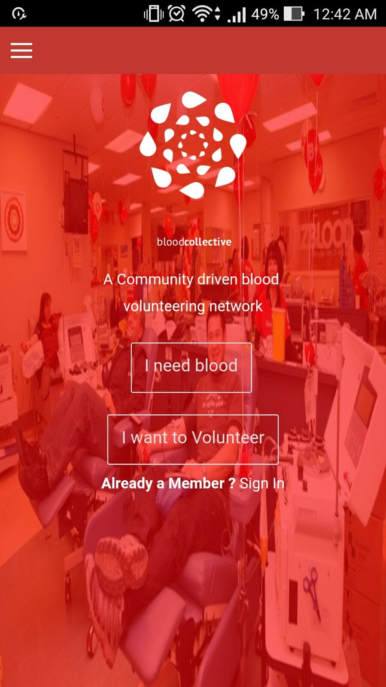
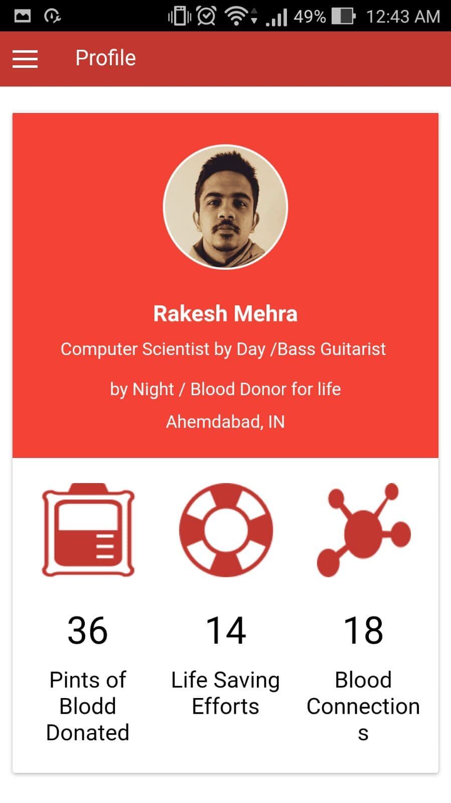
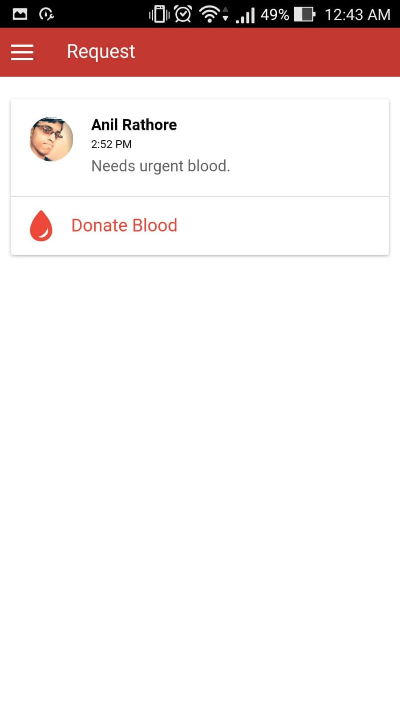
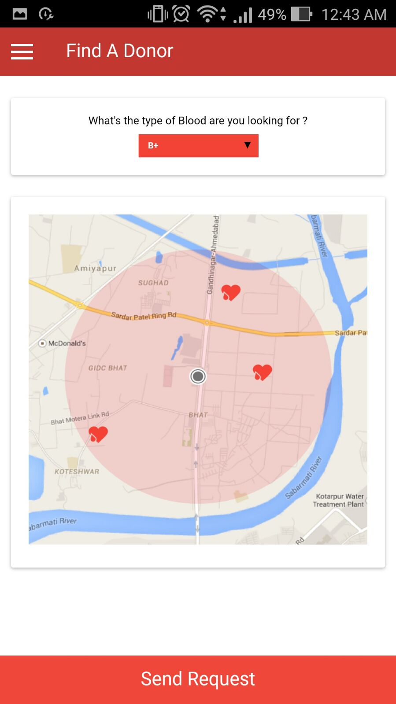
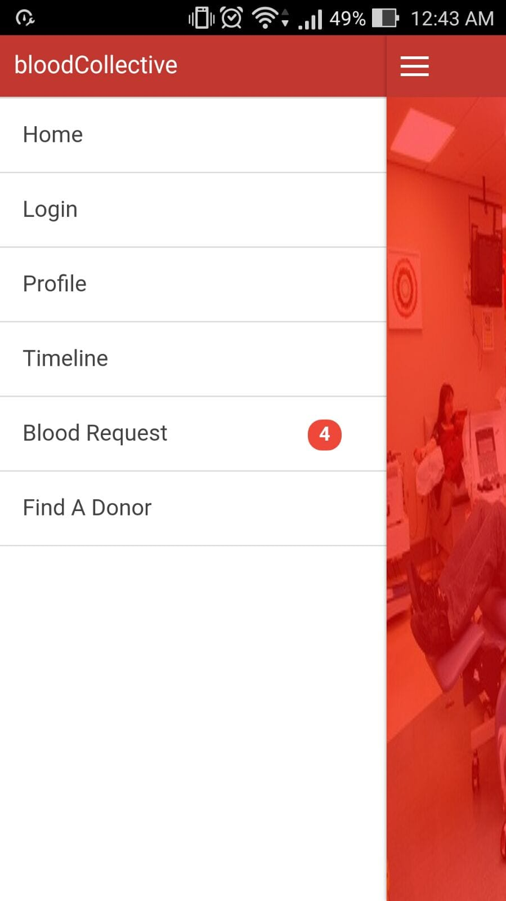
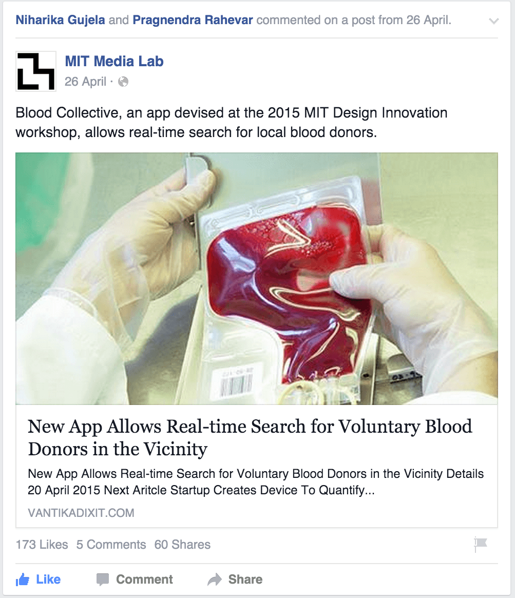

### Blood Collective - Community Driven Blood Donation Network
***

> “Despite being a country with a population of 1.2 billion, India faces a blood shortage of 3 million units. ”

**Problem Statement**: In India it is a rare chance that you will get blood when you need it. Some people do not want to donate blood, while some who are willing to do it find it frustrating to go to the blood banks criteria, fill forms and donate. Tapping into this community of voluntary blood donors therefore remains a challenge. The current gap between the demand for blood and its supply also leaves scope for touts, agents and illegal, unsafe blood donation.
According to a 2012 World Health Organization (WHO), every country needs at least a one percent blood reserve. India, with its 1.2 billion population, needs 12 million units of blood annually but collects only nine million of which 70 percent is from voluntary blood donors while the remaining 30 percent is from family/replacement donors.
Even though most blood collection is done from voluntary donors, the voluntary blood donors network remains fragmented and inaccessible to a large community in the time of need. The Blood Collective smart phone application aims to tap into this existing network of blood donors and bring them at your fingertips.

**Solution**:
> “If you need blood, connect directly with the blood donors and see if they are willing to offer help.”

Voluntary blood donation is considered the highest form of humanitarian service as it is done without the expectation of knowing who it will eventually help. Each unit of blood donation helps many patients as blood is usually segregated into RBCs, Platelets, WBCs and Plasma and given away as per requirement. But then there are yet not enough people who opt to donate blood.

### MIT Media Lab Design Innovation Workshop
***
The Media Lab India Initiative is an outreach program by students and alumni from the MIT Media Lab to bring together a community of makers and creators across India, and to facilitate collaboration and sharing of ideas across boundaries of disciplines, institutions and culture. The goal is to create an environment much like at the MIT Media Lab, an environment that fosters creative exploration of ideas.

### The Team
***
Combining different skills, each team member contributed differently to create the alpha version of the app and test it during the workshop. While IT industry professional Pragnendra Rahevar (32) floated the idea and shared the concept, National Institute of Design graduate Akshah Ish (27) designed the complete user interface of the application. The core development of the app has been done by Ayush Sharma (20) of Arya College of Engineering and IT, Jaipur, with necessary research and support provided by Abhimanyu Kumar (20) of Haldia Institute of Technology, West Bengal.

### Highlights MVP
***
The Media Lab India Initiative is an outreach program by students and alumni from the MIT Media Lab to bring together a community of makers and creators across India, and to facilitate collaboration and sharing of ideas across boundaries of disciplines, institutions and culture. The goal is to create an environment much like at the MIT Media Lab, an environment that fosters creative exploration of ideas.

### Social Media Attraction
***
Our application is also highlighted by MIT Media Labs & Innovation A blog by independent journalist Vantika Dixit. Link

### Features
***
We developed a MVP during workshop for the Android Platform with following features:
 - Real time tracking of Blood Donors.
 - Profile of Blood donors and receivers.
 - Direct Messages.
 - Spread awareness for Blood Donation.
 - Share contact information.

### Technology Stack
***
HTML5 CSS3 Angular JS Apache Cordova Ubuntu

### Learning & Experience
***
This workshop is the awesome workshop I have ever attend. Solve my various problems and doubts with introduction to MIT Media Lab community. I was in Civic Innovation track under the supervision of Rahul Bhargva, Alexis Hope and Sands Fish.
 - A field trip to Gujrat's largest slum to identify the existed problems.
 - Analyzed Rag Picking Systems.
 - Visited Mahatma Gandhi Ashram in Sabarmati to know about the story of truth and non-violence in freedom movement of India.
 - Visited Toilet Cafe,Learn about Sanitation Movement in India and how bio gas could be used as Fuel.
 - Visited Seva Cafe - A place where peole come and servers their services, passion without any exchange of money.
 - Group Discussions, Pitching Methods, Poster Making, Product Designing and Design Synthesis.
 - Learn about info-graphics, open data sets and interactive visualizations.
 - Use of Google APIs.
